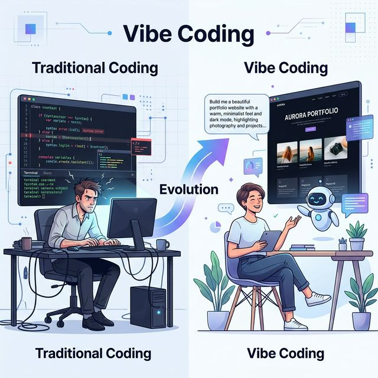
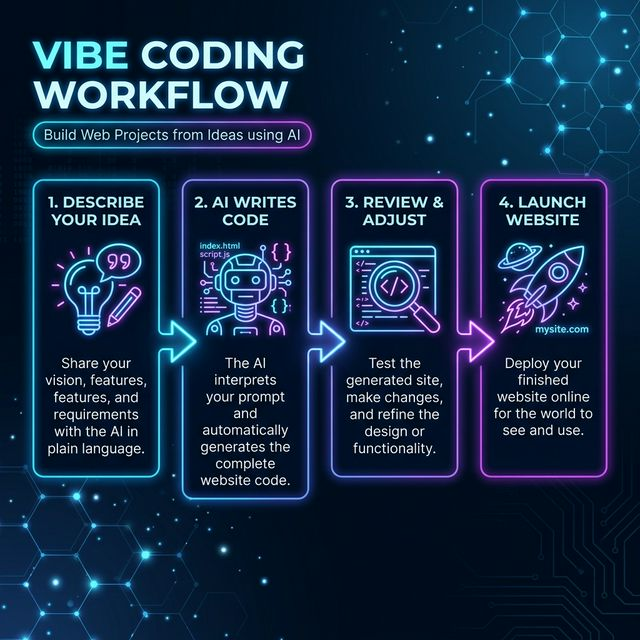
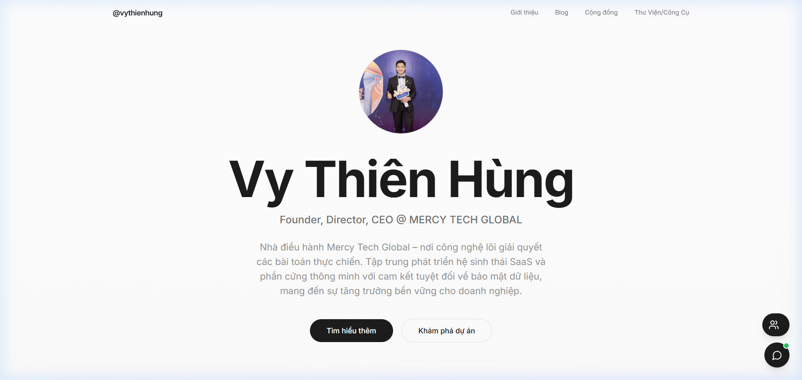
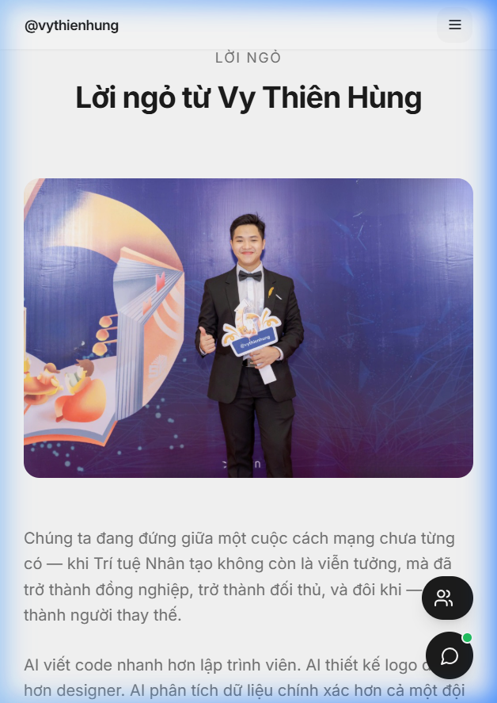
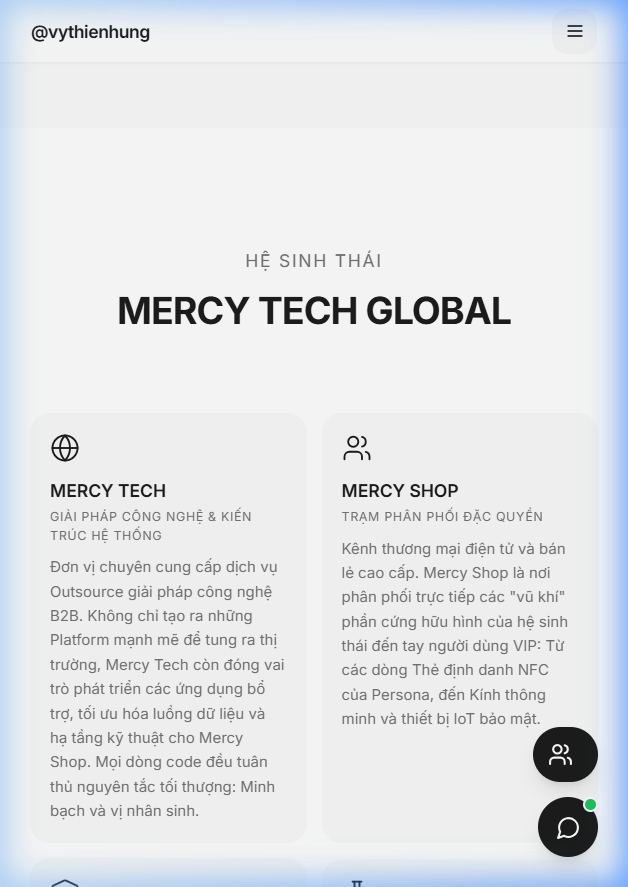
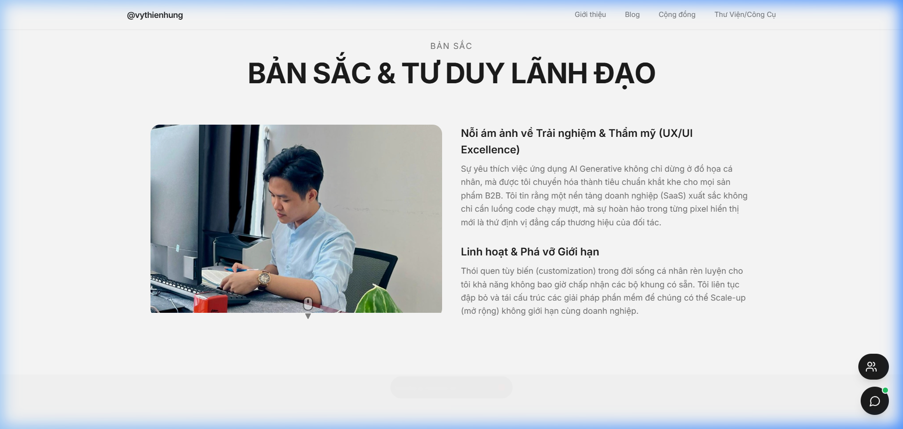
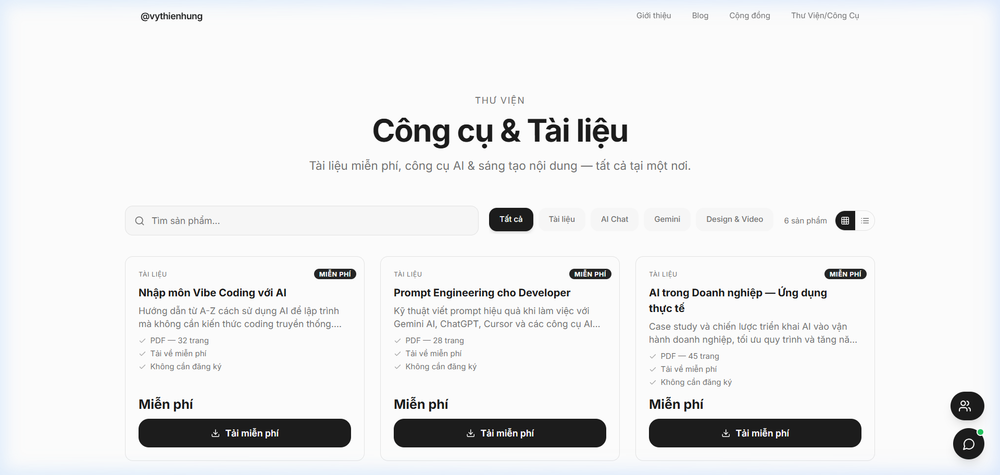
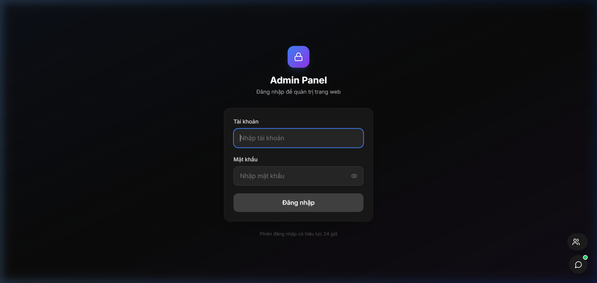
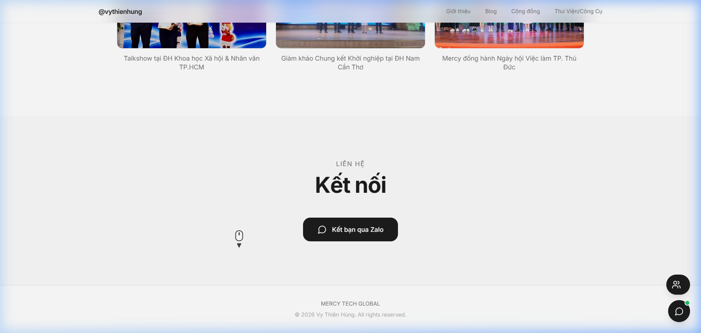

# PHẦN 1: NHẬP MÔN — HIỂU VỀ VIBE CODING

---

# Chương 1: Vibe Coding Là Gì?

> *"Đừng để cái gì bạn không biết ngăn cản bạn bắt đầu."*

---

## 1.1. Câu Chuyện Về Hai Thế Giới

Hãy tưởng tượng bạn muốn xây một ngôi nhà.

**Cách truyền thống:** Bạn phải học kiến trúc 4 năm, biết vẽ bản thiết kế, hiểu cấu trúc chịu lực, tự tay xây từng viên gạch. Mất hàng năm trời mới có một căn nhà.

**Cách mới:** Bạn nói với một kiến trúc sư thiên tài: *"Anh muốn một căn nhà 3 phòng ngủ, có sân vườn, phong cách hiện đại, màu trắng chủ đạo."* — và kiến trúc sư đó xây cho bạn trong vài giờ.

Đó chính là sự khác biệt giữa **lập trình truyền thống** và **Vibe Coding**.



---

## 1.2. Lập Trình Truyền Thống vs. Vibe Coding

Hãy cùng xem ví dụ cụ thể:

### Muốn tạo một nút bấm "Đăng ký" trên website

**Lập trình truyền thống** — bạn phải viết code như thế này:

```html
<button class="btn-register" onclick="handleRegister()">
  Đăng ký
</button>

<style>
.btn-register {
  background: linear-gradient(135deg, #667eea 0%, #764ba2 100%);
  color: white;
  padding: 12px 32px;
  border: none;
  border-radius: 25px;
  font-size: 16px;
  cursor: pointer;
  transition: transform 0.2s ease;
}
.btn-register:hover {
  transform: scale(1.05);
}
</style>

<script>
function handleRegister() {
  // Xử lý logic đăng ký...
}
</script>
```

Bạn phải biết HTML, CSS, JavaScript, hiểu `class`, `onclick`, `transition`, `transform`... Đau đầu chưa?

**Vibe Coding** — bạn chỉ cần nói với AI:

> *"Em tạo cho anh một nút bấm 'Đăng ký', màu tím gradient, bo tròn, có hiệu ứng phóng to nhẹ khi di chuột vào nhé."*

**Xong.** AI sẽ viết toàn bộ code trên cho bạn. Bạn không cần hiểu một chữ code nào.

### Bảng so sánh

| Tiêu chí | Lập trình truyền thống | Vibe Coding |
|----------|----------------------|-------------|
| **Kiến thức cần có** | HTML, CSS, JS, Framework... | Biết mô tả ý tưởng |
| **Ngôn ngữ giao tiếp** | Code (tiếng máy) | Tiếng Việt / Tiếng Anh |
| **Thời gian học** | Hàng tháng - hàng năm | Vài giờ đọc cuốn sách này |
| **Ai viết code?** | Bạn | AI |
| **Ai nghĩ ý tưởng?** | Bạn | Bạn |
| **Vai trò của bạn** | Lập trình viên | Đạo diễn |

---

## 1.3. Nguồn Gốc Của Thuật Ngữ "Vibe Coding"

Vào **tháng 2 năm 2025**, **Andrej Karpathy** — một trong những nhà nghiên cứu AI hàng đầu thế giới, cựu nhà nghiên cứu của OpenAI và Tesla AI — đã đưa ra thuật ngữ **"Vibe Coding"** (lập trình theo cảm xúc).

Ông mô tả trải nghiệm mới này như sau:

> *"Có một cách viết code mới mà tôi gọi là 'vibe coding'. Bạn hoàn toàn buông bỏ ý tưởng rằng code phải do mình viết. Bạn chỉ cần nói, nhìn, chạy thử, copy-paste các lỗi, và tinh chỉnh cho đến khi nó hoạt động."*

Nói đơn giản: **Vibe Coding = Bạn mô tả + AI code + Bạn tinh chỉnh**

### Tại sao gọi là "Vibe"?

"Vibe" trong tiếng Anh có nghĩa là "cảm xúc", "năng lượng". Vibe Coding nghĩa là bạn lập trình theo cảm xúc của mình — thấy chưa đẹp thì nói AI sửa, thấy thiếu gì thì nói AI thêm. Không cần logic phức tạp, không cần thuật toán — chỉ cần **cảm nhận** và **phản hồi**.

---

## 1.4. Quy Trình Vibe Coding — 4 Bước Đơn Giản



### Bước 1: 💡 Mô tả ý tưởng
Bạn nói hoặc gõ điều bạn muốn. Ví dụ:
> *"Em tạo cho anh một trang web cá nhân, có phần giới thiệu, blog, và portfolio."*

### Bước 2: 🤖 AI viết code
AI nhận yêu cầu và tự động viết toàn bộ code. Nó thậm chí tự tạo cấu trúc folder, tải các thư viện cần thiết, và viết hàng trăm dòng code trong vài giây.

### Bước 3: 🔍 Xem xét & Điều chỉnh
Bạn xem kết quả, thấy gì chưa ưng thì nói:
> *"Đổi màu nền thành đen đi em"*
> *"Font chữ to hơn chút"*
> *"Thêm phần liên hệ ở cuối trang"*

### Bước 4: 🚀 Hoàn thiện & Triển khai
Khi hài lòng, bạn đưa website lên internet cho mọi người truy cập.

**Và đó là tất cả. Bạn vừa tạo ra một website mà không viết một dòng code nào.**

---

## 1.5. Tại Sao Vibe Coding Phù Hợp Với Bạn?

Bạn có thể đang nghĩ: *"Nghe hay quá, nhưng có thật không?"*

**Câu trả lời: Hoàn toàn có thật.** Và tác giả cuốn sách này là bằng chứng sống.

### Bạn cần có gì để Vibe Coding?

1. ✅ **Một chiếc máy tính** (Windows, Mac, hoặc Linux đều được)
2. ✅ **Kết nối Internet** (AI cần mạng để hoạt động)
3. ✅ **Khả năng mô tả ý tưởng** (biết nói điều mình muốn)
4. ✅ **Kiên nhẫn** (kết quả không hoàn hảo ngay lần đầu — và điều đó hoàn toàn bình thường)

### Bạn KHÔNG cần:
- ❌ Bằng cấp IT
- ❌ Kinh nghiệm lập trình
- ❌ Hiểu biết về HTML, CSS, JavaScript
- ❌ Kỹ năng toán học cao cấp

---

> **📦 TÓM TẮT CHƯƠNG 1**
>
> - **Vibe Coding** là phương pháp lập trình mới, nơi bạn mô tả ý tưởng bằng ngôn ngữ tự nhiên và AI viết code cho bạn
> - Thuật ngữ do **Andrej Karpathy** đưa ra vào tháng 2/2025
> - Quy trình 4 bước: **Mô tả → AI code → Điều chỉnh → Triển khai**
> - Bạn không cần biết code — chỉ cần biết mô tả điều mình muốn
> - Vai trò của bạn: **Đạo diễn**, không phải lập trình viên

---

> **✏️ BÀI TẬP CHƯƠNG 1**
>
> Hãy viết ra 3 ý tưởng website mà bạn muốn tạo. Đừng lo về tính khả thi — cứ mơ lớn! Ví dụ:
> 1. Website bán hàng online cho cửa hàng đồ ăn vặt
> 2. Blog cá nhân chia sẻ kinh nghiệm du lịch
> 3. Portfolio trưng bày các tác phẩm nhiếp ảnh
>
> Giữ danh sách này — chúng ta sẽ dùng nó ở các chương sau!

---
---

# Chương 2: Bức Tranh Toàn Cảnh — Công Cụ AI Coding

> *"Chọn đúng công cụ là hoàn thành một nửa công việc."*

---

## 2.1. Thế Giới Công Cụ Vibe Coding

Vibe Coding bùng nổ từ năm 2025, và kéo theo đó là hàng loạt công cụ ra đời. Mỗi công cụ có ưu nhược điểm riêng. Hãy cùng điểm qua những cái tên nổi bật:

### 🤖 ChatGPT (OpenAI)
- **Dạng:** Website chat / App
- **Ưu:** Phổ biến nhất, dễ dùng, trả lời mọi câu hỏi
- **Nhược:** Chỉ tạo code rời rạc, bạn phải tự copy-paste vào project
- **Phù hợp:** Hỏi đáp, học concept, viết code nhỏ

### 💎 Gemini (Google)
- **Dạng:** Website chat / App / Tích hợp vào công cụ
- **Ưu:** Mô hình AI mạnh mẽ, hiểu tiếng Việt tốt
- **Nhược:** Tương tự ChatGPT — cần copy-paste code
- **Phù hợp:** Brainstorm ý tưởng, viết prompt, tạo nội dung

### ⚡ Cursor
- **Dạng:** Code Editor (giống VS Code nhưng có AI tích hợp)
- **Ưu:** AI trực tiếp sửa file code, rất mạnh cho developer
- **Nhược:** Cần kiến thức code cơ bản, bản Pro trả phí
- **Phù hợp:** Người đã biết code muốn tăng tốc

### 🔮 Replit Agent
- **Dạng:** IDE online (chạy trên trình duyệt)
- **Ưu:** Tất cả trong một — code, chạy, deploy ngay trên web
- **Nhược:** Giới hạn miễn phí, cần internet ổn định
- **Phù hợp:** Prototype nhanh, không muốn cài đặt gì

### 🌟 Lovable / Bolt / Softgen
- **Dạng:** No-code/Low-code platform
- **Ưu:** Giao diện kéo thả, không cần code
- **Nhược:** Giới hạn tùy biến, phụ thuộc platform
- **Phù hợp:** Tạo MVP (sản phẩm tối thiểu) nhanh chóng

### 🚀 **Google Antigravity** — Nhân vật chính của cuốn sách này
- **Dạng:** Agent-first IDE (phần mềm viết code thông minh)
- **Ưu:** AI tự động lên kế hoạch, code, kiểm tra — MIỄN PHÍ
- **Nhược:** Còn mới (public preview từ 11/2025)
- **Phù hợp:** **Mọi cấp độ — đặc biệt là Vibe Coding**

---

## 2.2. Tại Sao Chọn Google Antigravity?

Trong hàng loạt công cụ kể trên, tại sao cuốn sách này chọn Antigravity? Đây là lý do:

### 🎯 1. Agent-First — AI Làm Hết, Bạn Chỉ Duyệt

Hầu hết các công cụ khác hoạt động theo kiểu **"bạn hỏi, AI trả lời"** — bạn phải tự áp dụng câu trả lời. Antigravity khác:

- AI **tự lên kế hoạch** (Implementation Plan)
- AI **tự viết code** vào đúng file
- AI **tự chạy lệnh** trong terminal
- AI **tự kiểm tra** kết quả
- Bạn chỉ cần **đọc plan → Approve → Xem kết quả**

### 🎯 2. Miễn Phí

Antigravity miễn phí (public preview), sử dụng Gemini 3.1 Pro — mô hình AI mạnh nhất của Google.

### 🎯 3. Tất Cả Trong Một

Antigravity tích hợp:
- **Editor** (viết/sửa code)
- **Terminal** (chạy lệnh)
- **Browser** (xem kết quả)
- **Chat** (nói chuyện với AI)

Bạn không cần mở thêm bất kỳ phần mềm nào khác.

### 🎯 4. Artifacts — AI "Báo Cáo" Minh Bạch

Đây là điểm độc đáo nhất. Mỗi khi AI làm việc, nó tạo ra "artifacts" — các bản báo cáo rõ ràng:
- **Task List:** Danh sách việc cần làm ✅
- **Implementation Plan:** Kế hoạch chi tiết trước khi code
- **Walkthrough:** Tóm tắt những gì đã làm
- **Screenshots & Recordings:** Hình chụp và video quay lại quá trình

Bạn luôn biết AI đang làm gì — không sợ bị "cầm đèn chạy trước ô tô".

### 🎯 5. Hiểu Tiếng Việt Xuất Sắc

Bạn có thể nói chuyện với Antigravity hoàn toàn bằng tiếng Việt. Ví dụ:

> *"Em ơi, tạo cho anh một trang web cá nhân, có phần hero section với avatar tròn ở giữa, tên ở dưới, font chữ to và đẹp nhé."*

AI hiểu và thực hiện — không cần dịch qua tiếng Anh.

---

## 2.3. Bảng So Sánh Nhanh

| Tiêu chí | ChatGPT | Cursor | Replit | Lovable | **Antigravity** |
|----------|---------|--------|--------|---------|-----------------|
| **Miễn phí** | Giới hạn | Có bản Free | Giới hạn | Giới hạn | ✅ **Miễn phí** |
| **Tự viết file** | ❌ | ✅ | ✅ | ✅ | ✅ |
| **Tự chạy lệnh** | ❌ | ❌ | ✅ | ❌ | ✅ |
| **Tự plan** | ❌ | ❌ | Một phần | ❌ | ✅ |
| **Tiếng Việt** | Tốt | Khá | Trung bình | Trung bình | **Rất tốt** |
| **Cho newbie** | Trung bình | Khó | Khá | Dễ | **Rất dễ** |
| **Tích hợp** | Chat only | Editor+AI | Full IDE | No-code | **Full IDE+Agent** |

---

## 2.4. Antigravity Hoạt Động Như Thế Nào?

Hãy tưởng tượng bạn thuê một nhân viên cực kỳ giỏi. Khi bạn giao việc:

1. **Nhân viên lên kế hoạch** (Plan) — "Em sẽ làm những bước này..."
2. **Bạn duyệt kế hoạch** (Approve) — "OK, triển khai đi em"
3. **Nhân viên thực hiện** (Execute) — Tự tạo file, viết code, cài đặt thư viện
4. **Nhân viên báo cáo** (Walkthrough) — "Em đã hoàn thành, đây là kết quả"
5. **Bạn xem kết quả** (Review) — "Đẹp lắm!" hoặc "Sửa lại chỗ này giùm anh"

Đó chính xác là cách Antigravity hoạt động. Bạn là **ông chủ**, AI là **nhân viên** — một nhân viên không bao giờ mệt mỏi, không bao giờ phàn nàn, và làm việc với tốc độ siêu nhân.

---

> **📦 TÓM TẮT CHƯƠNG 2**
>
> - Có rất nhiều công cụ Vibe Coding: ChatGPT, Cursor, Replit, Lovable...
> - **Google Antigravity** được chọn vì: miễn phí, agent-first, tích hợp đầy đủ, hiểu tiếng Việt tốt
> - Antigravity hoạt động như một **nhân viên tự động**: plan → execute → report
> - Bạn chỉ cần giao việc và duyệt kết quả

---

> **✏️ BÀI TẬP CHƯƠNG 2**
>
> 1. Truy cập và tải Google Antigravity về máy (xem Chương 4 để hướng dẫn chi tiết)
> 2. Nếu bạn đã dùng ChatGPT hoặc Gemini, thử gõ prompt: *"Tạo cho tôi một trang web đơn giản với tiêu đề 'Xin chào thế giới'"* — quan sát sự khác biệt khi dùng chat bình thường

---
---

# Chương 3: Câu Chuyện Của Tác Giả — Từ Ý Tưởng Đến Website

> *"Hành trình vạn dặm bắt đầu từ một bước chân."*

---

## 3.1. Tôi Là Ai?

Tôi là **Vy Thiên Hùng** — Nhà sáng lập và CEO của **MERCY TECH GLOBAL**, một công ty công nghệ tập trung vào phát triển hệ sinh thái SaaS và phần cứng thông minh.



Khi bắt đầu hành trình Vibe Coding, tôi không hề có kiến thức sâu về lập trình web. Tôi biết ý tưởng của mình — biết mình muốn xây dựng điều gì — nhưng việc biến ý tưởng thành code? Đó là một rào cản rất lớn.

Cho đến khi tôi gặp **Google Antigravity**.

---

## 3.2. Dự Án VyThienHung.blog — Case Study Thực Tế

Dự án **VyThienHung.blog** là website cá nhân/portfolio của tôi. Đây là case study xuyên suốt cuốn sách — vì đây chính là website tôi đã xây dựng từ con số 0 bằng Vibe Coding.

### Những gì đã tạo ra:

#### 🏠 Trang Chủ — Hero Section
Phần đầu trang với avatar tròn, tên, chức danh, mô tả ngắn, và 2 nút bấm. Tất cả đều có hiệu ứng animation mượt mà.

#### 👤 Giới Thiệu Bản Thân (About)
Section giới thiệu với layout chuyên nghiệp, chia cột, hiệu ứng scroll.



#### 🌐 Hệ Sinh Thái (Ecosystem)
Grid hiển thị các dự án, sản phẩm, công cụ — responsive trên mọi thiết bị.



#### 📝 Blog
Trang blog với danh sách bài viết, hình ảnh thumbnail, phân loại theo category.



#### 📚 Thư Viện Công Cụ & Tài Liệu
Trang thư viện tích hợp sản phẩm, ebooks miễn phí, công cụ AI — có tìm kiếm và filter.



#### 🔐 Admin Panel
Hệ thống quản trị để thêm/sửa/xóa nội dung — với giao diện đăng nhập bảo mật.



#### 📞 Liên Hệ & Footer
Section liên hệ với các liên kết mạng xã hội, form liên hệ, copyright.



---

## 3.3. Công Nghệ Đằng Sau (AI Đã Chọn Cho Tôi)

Điều thú vị là tôi không hề chọn những công nghệ này — **AI đã chọn chúng cho tôi**. Khi tôi nói "tạo website cá nhân", Antigravity đã tự động quyết định sử dụng:

| Công nghệ | Vai trò | Giải thích đơn giản |
|-----------|---------|---------------------|
| **React** | Frontend | "Bộ LEGO" để xây giao diện |
| **TypeScript** | Ngôn ngữ | "Tiếng nói" mà máy tính hiểu |
| **Vite** | Build tool | "Máy đóng gói" code |
| **Tailwind CSS** | Styling | "Hộp sơn" để tô đẹp giao diện |
| **Express.js** | Backend | "Nhân viên lễ tân" xử lý yêu cầu |
| **MySQL** | Database | "Tủ hồ sơ" lưu trữ dữ liệu |
| **Framer Motion** | Animation | "Phù thủy" tạo hiệu ứng chuyển động |

**Bạn không cần hiểu bất kỳ cái nào trong bảng trên.** Tôi liệt kê chỉ để bạn biết — website này không phải đồ chơi. Nó sử dụng cùng công nghệ mà các công ty lớn đang dùng.

---

## 3.4. Hành Trình Xây Dựng — Không Phải Lúc Nào Cũng Suôn Sẻ

Tôi phải thành thật: **hành trình Vibe Coding không phải lúc nào cũng suôn sẻ.** 

### Những thử thách đã gặp:

📌 **Logo không hiển thị** — Sau khi cập nhật, logo biến mất. Phải nhờ AI kiểm tra đường dẫn file.

📌 **Server không chạy** — Lần đầu deploy lên VPS, server không khởi động. Lỗi do cấu hình `package.json`.

📌 **Dữ liệu mất khi deploy** — Thay đổi trên admin panel bị mất khi deploy phiên bản mới. Nguyên nhân: file dữ liệu mặc định ghi đè.

📌 **Apache báo lỗi "Service Unavailable"** — Cấu hình proxy trên VPS bị sai.

📌 **Layout mobile vỡ** — Ecosystem hiển thị đẹp trên desktop nhưng bị vỡ trên điện thoại.

**Nhưng mỗi lần gặp lỗi, tôi chỉ cần nói với AI:**

> *"Em ơi, anh gặp lỗi này... [paste lỗi vào]. Em xử lý giúp anh nhé."*

Và AI sửa cho tôi. Đôi khi một lần chưa đúng, phải thử 2-3 lần — nhưng cuối cùng luôn tìm ra giải pháp.

**Đó là bài học lớn nhất:** *Lỗi là bình thường. Quan trọng là bạn có AI đồng hành để giải quyết.*

---

## 3.5. Bài Học Rút Ra

Sau hành trình xây dựng VyThienHung.blog, đây là những bài học quý giá:

### 💡 Bài học 1: Không cần biết code từ trước
Tôi không viết một dòng code nào bằng tay. Tất cả đều thông qua prompt.

### 💡 Bài học 2: Kỹ năng quan trọng nhất là MÔ TẢ
Bạn mô tả càng rõ, kết quả càng chính xác. "Tạo nút đẹp" sẽ cho kết quả khác xa so với "Tạo nút bo tròn, gradient tím-hồng, viền nhẹ, có shadow, phóng to khi hover".

### 💡 Bài học 3: Chia nhỏ yêu cầu
Đừng nói "Tạo cả website" — hãy nói "Tạo phần header trước", rồi "Thêm phần about", rồi "Thêm blog"... Từng bước một.

### 💡 Bài học 4: Kiên nhẫn tinh chỉnh
Website không bao giờ hoàn hảo ngay lần đầu. Cần 5-10 lần tinh chỉnh cho mỗi section. Đó là bình thường.

### 💡 Bài học 5: Commit thường xuyên
"Commit" giống như "save game" — mỗi khi có kết quả tốt, hãy lưu lại. Nếu AI làm hỏng sau đó, bạn luôn có thể quay lại.

---

> **📦 TÓM TẮT CHƯƠNG 3**
>
> - Tác giả Vy Thiên Hùng đã xây website VyThienHung.blog từ 0 bằng Vibe Coding
> - Website hoàn chỉnh gồm: Trang chủ, About, Ecosystem, Blog, Thư viện, Admin
> - Hành trình không suôn sẻ — gặp nhiều lỗi nhưng AI luôn giúp giải quyết
> - 5 bài học: Không cần biết code, mô tả rõ ràng, chia nhỏ, kiên nhẫn, commit thường xuyên

---

> **✏️ BÀI TẬP CHƯƠNG 3**
>
> 1. Quay lại danh sách 3 ý tưởng ở Chương 1. Chọn **1 ý tưởng** yêu thích nhất
> 2. Viết ra **5 tính năng** bạn muốn website đó có (VD: trang chủ, trang sản phẩm, form liên hệ...)
> 3. Cho mỗi tính năng, viết **1-2 câu mô tả** cụ thể (VD: "Trang chủ có banner lớn với hình nền gradient xanh dương, tiêu đề trắng ở giữa")
>
> Đây chính là bước đầu tiên của Vibe Coding — **mô tả ý tưởng!**
